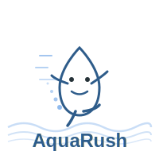

<div align="center">
  
  <h1>AquaRush - WeChat Bottled Water Ordering System</h1>
</div>

A modern, lightweight bottled water ordering and delivery management system for WeChat Mini Program, designed for single-server deployment with minimal operational overhead.

## 🎯 Features

- **User Management**: WeChat Mini Program login (code2Session), user profile & delivery addresses
- **Order Management**: Create, query, cancel orders with inventory control and idempotency
- **Payment Integration**: WeChat Pay v3 (JSAPI/H5) with signature verification and callback handling
- **Delivery Tracking**: Dispatch management, rider assignment, route optimization
- **Notifications**: WeChat subscription messages for order updates and delivery notifications
- **Admin Dashboard**: Order management, inventory control, user management, reporting

## 🛠️ Tech Stack

### Backend (Single-Server Deployment)
- **Framework**: Spring Boot 3.x (Kotlin multi-module project)
- **Language**: Kotlin + Java 21
- **Database**: PostgreSQL (or MySQL 8) with Liquibase migration
- **Async/Tasks**: Database Outbox pattern + scheduled polling (no external MQ required)
- **Payment**: WeChat Pay v3 SDK (wechatpay-apiv3)
- **Security**: Spring Security + JWT
- **Reverse Proxy**: Caddy (auto HTTPS with Let's Encrypt) or Nginx
- **Monitoring**: Spring Boot Actuator + Logback (JSON logging)

### Frontend
- **User Mini Program**: Remax (React for WeChat Mini Program) + TypeScript
- **Delivery Mini Program**: Remax + TypeScript + React
- **Admin Dashboard**: React 18 + Vite + Ant Design 5 + TypeScript
- **State Management**: React Hooks
- **HTTP Client**: Axios with interceptors
- **Routing**: React Router 6 (Admin Dashboard)
- **Build Tool**: Remax CLI (Mini Programs), Vite (Admin Dashboard)

## 📁 Project Structure

```
AquaRush/
├── modules/                        # Backend - Kotlin Multi-Module
│   ├── common-module/              # Common utilities, exceptions, base classes
│   ├── user-module/                # User management & authentication
│   ├── product-module/             # Product catalog & inventory
│   ├── order-module/               # Order processing & workflow
│   ├── delivery-module/            # Delivery task assignment & tracking
│   ├── payment-module/             # WeChat Pay integration
│   ├── statistics-module/          # Revenue & analytics
│   └── entry-module/               # Spring Boot main application entry
│       ├── src/main/resources/
│       │   ├── db/changelog/       # Liquibase migrations
│       │   └── application.yml     # Configuration
│       └── AquaRushApplication.kt  # Main entry point
├── frontend/                       # Frontend applications
│   ├── user-client/                # User Mini Program (Remax)
│   │   ├── src/
│   │   │   ├── pages/              # Home, Orders, Profile, Address
│   │   │   ├── services/           # API services
│   │   │   ├── assets/             # TabBar icons
│   │   │   └── app.tsx             # App entry
│   │   └── package.json
│   ├── delivery-client/            # Delivery Mini Program (Remax)
│   │   ├── src/
│   │   │   ├── pages/              # Tasks, History, Profile
│   │   │   ├── services/           # API services
│   │   │   ├── assets/             # TabBar icons
│   │   │   └── app.tsx             # App entry
│   │   └── package.json
│   ├── admin-client/               # Admin Dashboard (React + Vite)
│   │   ├── src/
│   │   │   ├── pages/              # Login, Dashboard, Management
│   │   │   ├── components/         # Layout, PrivateRoute
│   │   │   ├── services/           # API services
│   │   │   ├── App.tsx             # Route configuration
│   │   │   └── main.tsx            # App entry
│   │   ├── index.html
│   │   ├── vite.config.ts
│   │   └── package.json
│   ├── README.md                   # Frontend documentation (Chinese)
│   └── README_EN.md                # Frontend documentation (English)
├── scripts/                        # Deployment & maintenance scripts
│   ├── aquarush.service            # systemd service
│   ├── backup.sh                   # Database backup
│   └── deploy.sh                   # Deployment automation
├── build.gradle.kts                # Root build configuration
├── settings.gradle.kts             # Multi-module settings
└── gradle.properties               # Project properties
```

## 🚀 Quick Start

### Prerequisites
- JDK 17 or 21
- PostgreSQL 14+ (or MySQL 8+)
- Node.js 18+ (for Mini Program)
- Caddy or Nginx (for HTTPS reverse proxy)

### Backend Setup

1. **Clone & Configure**
   ```bash
   git clone https://github.com/yidafu/AquaRush.git
   cd AquaRush
   cp modules/entry-module/src/main/resources/application.yml \
      modules/entry-module/src/main/resources/application-dev.yml
   # Edit application-dev.yml with your database & WeChat credentials
   ```

2. **Database Setup**
   ```bash
   # Create database
   createdb aqua_rush
   
   # Liquibase will run migrations automatically on startup
   # Or run manually:
   ./gradlew :modules:entry-module:update
   ```

3. **Build & Run**
   ```bash
   # Development mode
   ./gradlew :modules:entry-module:bootRun
   
   # Or build executable JAR
   ./gradlew :modules:entry-module:bootJar
   java -jar modules/entry-module/build/libs/entry-module.jar
   ```

4. **Health Check**
   ```bash
   curl http://localhost:8080/actuator/health
   # Backend API runs on http://localhost:8080
   ```

### Frontend Setup

#### User Mini Program
```bash
cd frontend/user-client
npm install --legacy-peer-deps
npm run dev
# Open WeChat Developer Tools and import the project
# Update project.config.json with your WeChat AppID
```

#### Delivery Mini Program
```bash
cd frontend/delivery-client
npm install --legacy-peer-deps
npm run dev
# Open WeChat Developer Tools and import the project
```

#### Admin Dashboard
```bash
cd frontend/admin-client
npm install
npm run dev  # Runs on http://localhost:5173
# Default login: admin / 123456 (mock)
```

**Note**: For detailed frontend documentation, see [frontend/README.md](frontend/README.md) or [frontend/README_EN.md](frontend/README_EN.md)

## 🔐 Security & Compliance

- **HTTPS**: Auto-managed by Caddy or manual setup with certbot
- **WeChat Pay**: Merchant private key & platform certificate handling
- **Secrets**: Store in environment variables or external config (never commit)
- **Domain Whitelist**: Configure in WeChat Mini Program/Official Account backend

## 📊 Key Design Patterns

### Idempotency
- Order creation: Unique business order ID + database unique constraint
- Payment callback: Transaction-safe status transition with Redis/DB-based deduplication

### Async Event Processing (No MQ)
- **Outbox Pattern**: Insert event record in same transaction as business logic
- **Polling Consumer**: `@Scheduled` task with `SELECT ... FOR UPDATE SKIP LOCKED`
- **Retry & Dead Letter**: Exponential backoff + manual intervention queue

### Inventory Control
- Optimistic locking or `SELECT ... FOR UPDATE` for stock deduction
- Pre-allocation on order creation, confirmation on payment success

## 🔧 Deployment (Single Server)

### systemd Service
```bash
sudo cp scripts/aquarush.service /etc/systemd/system/
sudo systemctl enable aquarush
sudo systemctl start aquarush
```

### Caddy Configuration
```caddyfile
api.yourdomain.com {
    reverse_proxy localhost:8080
    log {
        output file /var/log/caddy/aquarush.log
    }
}
```

### Backup
- Database: Daily full backup + WAL archiving (PostgreSQL)
- Secrets: Encrypted backups for merchant keys & certificates

## 📈 Monitoring & Observability

- **Metrics**: Spring Boot Actuator `/actuator/metrics`
- **Health Check**: `/actuator/health` (liveness & readiness probes)
- **Logs**: Structured JSON logging with Logback
- **Alerts**: Monitor event queue backlog, payment callback success rate

## 🧪 Testing

```bash
# Run all tests
./gradlew test

# Run specific module tests
./gradlew :core:application:test
```

## 📄 License

This project is licensed under the **GNU Affero General Public License v3.0 (AGPL-3.0)**.

**Key Points**:
- Network copyleft: Users accessing the service over network have the right to obtain source code
- Any modifications must also be released under AGPL-3.0
- Ideal for SaaS/network services to ensure cloud modifications remain open source

See [LICENSE](LICENSE) for full text.

## 🤝 Contributing

Contributions are welcome! Please read our [Contributing Guidelines](CONTRIBUTING.md) first.

1. Fork the repository
2. Create your feature branch (`git checkout -b feature/amazing-feature`)
3. Commit your changes (`git commit -m 'Add amazing feature'`)
4. Push to the branch (`git push origin feature/amazing-feature`)
5. Open a Pull Request

## 📞 Support

- Documentation: [Wiki](https://github.com/yourusername/AquaRush/wiki)
- Issues: [GitHub Issues](https://github.com/yourusername/AquaRush/issues)
- Discussions: [GitHub Discussions](https://github.com/yourusername/AquaRush/discussions)

## 🗺️ Roadmap

### Completed ✅
- [x] Backend multi-module architecture (Kotlin + Spring Boot)
- [x] User Mini Program (Remax + React)
- [x] Delivery Mini Program (Remax + React)
- [x] Admin Dashboard UI (React + Vite + Ant Design)
- [x] Authentication & authorization (Login, Route Guards)
- [x] User management (CRUD operations)
- [x] Database migrations (Liquibase)
- [x] TabBar icons for Mini Programs
- [x] Bilingual documentation (Chinese & English)

### In Progress 🚧
- [ ] Backend API implementation (Controllers, Services, Repositories)
- [ ] WeChat Pay v3 integration
- [ ] WeChat Mini Program login (code2Session)
- [ ] Order workflow & inventory management
- [ ] Delivery task assignment & tracking
- [ ] File upload (Product images, Delivery photos)

### Planned 📋
- [ ] Multi-tenant support
- [ ] Redis Streams for enhanced async processing
- [ ] SMS notifications
- [ ] Advanced analytics & reporting
- [ ] Docker & Kubernetes deployment
- [ ] CI/CD pipeline
- [ ] Performance optimization & caching

---

**Built with ❤️ for the open-source community**
